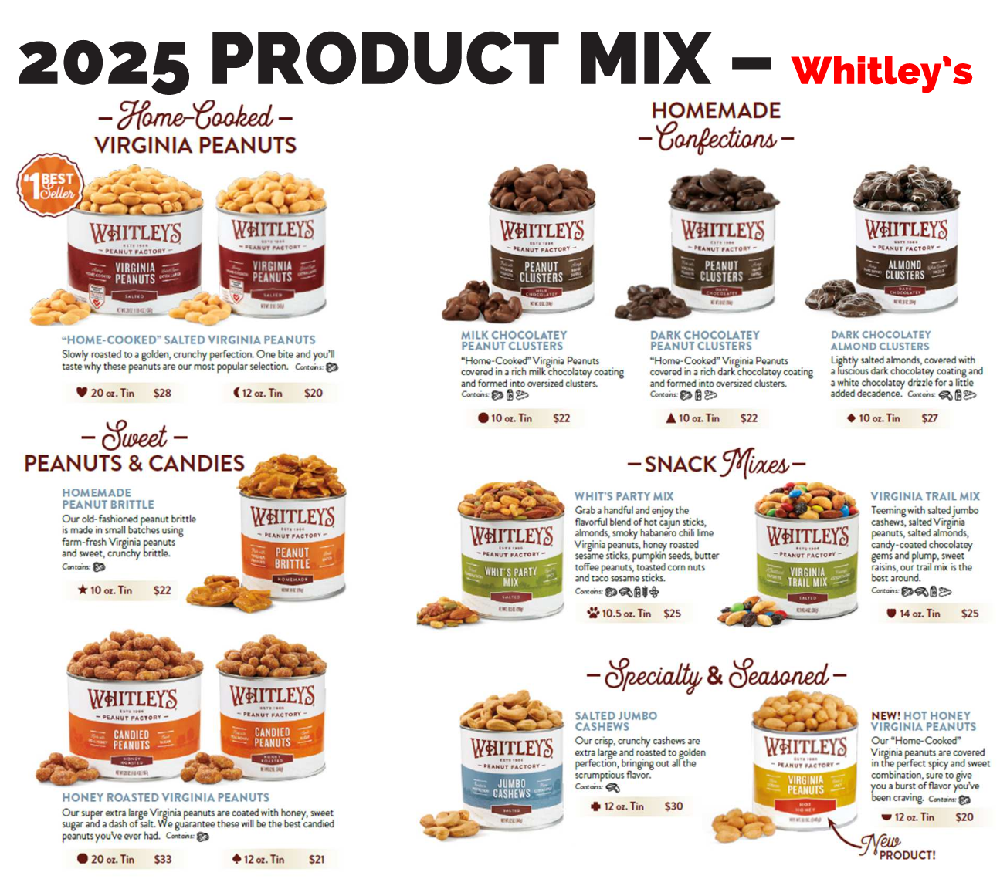

  <h2>Hello Pack 120 Families</h2>
  
With the start of a new scouting year comes one of our important traditions -
    <strong>Popcorn &amp; Peanut fundraising!</strong> This effort directly
      supports Pack activities, helping us funding adventures for every scout.

  
Our Pack goal is a <strong>blend of sales and dues</strong>:

  <ul>
    <li>Target: <strong>$300 in sales per Scout</strong> or
    <ul>
      <li>a combination: $150 sales + $40 dues or</li>
      <li>higher dues: $80 dues</li>
    </ul></li>
  </ul>
  <h2>How We Sell</h2>
  <ol start="1">
    <li>Show &amp; Sell (Storefront Sales) - Scouts sell from our inventory at local stores.</li>
    <li>Take Orders - Scouts take orders from family, friends, neighbors, co-workers, etc., then deliver in November.</li>
  </ol>
  <h2>Show &amp; Sell Dates</h2>
  <ul>
    <li>9/13 - Rocking R Hardware</li>
    <li>9/20 - Lowe's</li>
    <li>9/28 - TBD (need a volunteer
        coordinator for setup/takedown - we're out of town)</li>
    <li>Additional October dates are likely. We're also exploring Food
        Lion and welcome other suggestions!</li>
  </ul>
  
Please sign up for <strong>1-hour parent &amp; scout
    shifts</strong> here: <a
      href="https://www.signupgenius.com/go/10C0C49ADA623AAFFC43-58480644-popcorn#/" rel="noopener noreferrer" target="_blank" >Show
      &amp; Sell Signup Genius</a>

Daily sales will be split hourly between participating Scouts. We've stocked
    extra $10 items this year since they sold out quickly in 2024.

<h2>Take Orders</h2>
<ul>
  <li><strong>Order forms will be handed out at the Sept. 15 Pack meeting.</strong>
  </li>
  <li><strong>Orders with payment due Sunday, Oct. 19</strong> to your Den Leader or me (Mark Kipps).</li>
  <li>Payments can be made by cash, check, or Venmo (@mkipps). If using
      Venmo, please email me so I can track it.</li>
</ul>
<h2>Online Sales</h2>
<ul>
  <li><strong>Peanuts are not available online</strong>.
  </li>
  <li>Popcorn is sold via <strong>Pecatonica River
      Popcorn</strong>.</li>
</ul>
<ul>
  <li>Products differ from Take Orders (e.g., combo flavors vs.
      singles).</li>
  <li>Invitations will be emailed this week - share them via email
      or social media!</li>
  <li>Scouts get full credit for online orders.</li>
</ul>
<h2>Selling Tips</h2>
<ul>
  <li>Think <strong>family, friends, neighbors, coworkers,
      church members, and community connections.</strong></li>
  <li>Door-to-door sales with a parent or trusted adult are often very
      successful.</li>
  <li>Class A uniforms are effective at representing scouting and
      increasing sales.</li>
</ul>

## Resources
Attached are:
* (PDF) Product brochures for [(Pecatonica) Popcorn](Pecatonica_TWT_VHC_2025.pdf) and [(Whitley's) Peanuts](Whitley_s_2025_Scout_Fundraising_Brochure.pdf)</li>
* [Fundraising FAQ](2025--PopNuts--Q-A-for-parents.docx)

I'll review the program and answer questions at the <strong>Sept. 15 Pack meeting,</strong> and distribute hardcopy order forms.  Excerpts of products offered for sale are below.

Thank you for your support in making this fundraiser a success! With everyone’s help, we’ll fund a great year of Scouting adventures. 
 
Yours in Scouting, 
Mark Kipps 
Pack 120 – Treasurer & Popcorn Kernel