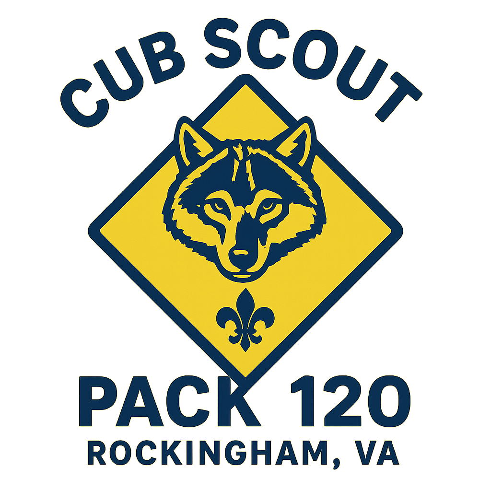

{}
## Cub Scout Pack 120 invites your child to join Cub Scouts. 

Come out and have a s'more, play games, and generally have fun while you and your child learn a little about scouts!

In Scouts, your child will have lots of FUN, learn new things, and make new friends.

<!-- qr code link from the flier https://my.scouting.org/VES/OnlineReg/1.0.0/?tu=UF-MB-763paa0120 -->

<dl>
  <dt>Who:</dt>
  <dd>All youth, Kindergarten through Grade 5</dd>
  <dt>What:</dt>
  <dd>Ready to: Derby Cars & More</dd>
  <dt>When:</dt>
  <dd>Monday, August 24, 2026</dd>
  <dd>6:00pm to 7:00pm</dd>
  <dt>Where:</dt>
  <dd>Rockingham Park at the Crossroads 
  <iframe src="https://www.google.com/maps/embed?pb=!1m18!1m12!1m3!1d3126.9551347436814!2d-78.8115232!3d38.3962864!2m3!1f0!2f0!3f0!3m2!1i1024!2i768!4f13.1!3m3!1m2!1s0x89b48d47f9740229%3A0x6a8bd9f2c66bf044!2sRockingham%20Park%20at%20the%20Crossroads!5e0!3m2!1sen!2sus!4v1757398939368!5m2!1sen!2sus" width="600" height="450" style="border:0;" allowfullscreen="" loading="lazy" referrerpolicy="no-referrer-when-downgrade"></iframe>
  </dd>
</dl>

Volunteers will be available to answer any questions from 6pm to 7:30pm.
{}
{}
## Interested in joining but can’t attend? 

If you already know you'd like to join our Pack and can't make it to our event, simply follow the link below to register your child as a cub scout.

<a class="btn btn-lg btn-primary me-3 mb-4 text-black" href="https://my.scouting.org/VES/OnlineReg/1.0.0/?tu=UF-MB-763paa0120">
  Follow this link! <i class="fas fa-arrow-alt-circle-right ms-2"></i>
</a>

{}

{}
Scouting is a family-oriented organization. Youth develop character, leadership, communication skills, and good citizenship.
This flyer hosted by Mountain Valley District, VAHC, Scouting of America.
The materials described herein are not sponsored by the Rockingham County School Board.
{}

{}
Please feel welcome to share our [Join Scouting Night 2026 Flier <i class="fa fa-solid fa-download"></i>](tbd.pdf) with your friends.
{}

